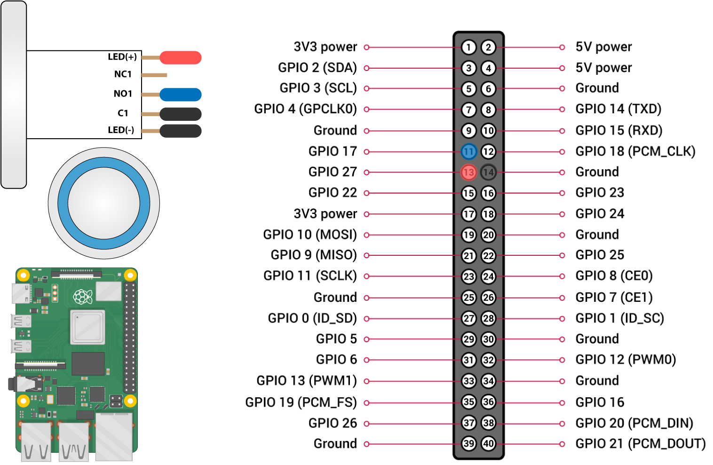

# Raspberry PI GPIO Button Tutorial
## Description
The button used is a metal pushbutton containing a blue LED which can be turned off and on through the python code. The link to the button used in this tutorial is [Adafruit Metal Blue Pushbutton](https://www.adafruit.com/product/481)

## Features
- Short press recognition 
- Long press recognition
- Button LED on and off 

## Wire Guide

The pi pictured above is the Raspberry Pi 4 however the GPIO pins are the same or very similar to other version a simple google search for your version of the raspberry pi will result in a similar schematic for wiring. This pushbutton has pins which allow you to separately control the LED. 

*Button Wiring*

- NO1 (Normally Open) is connected to pin 11 (GPIO 17)
- C1 (Common) is connected to pin 14 (Ground)

*LED Wiring*

- (+) is connected to pin 13 (GPIO 27)
- (-) is connected to pin 14 (Ground)

***Note: Both C1 and (-) can be connected to the same ground source***

## Python Explanation 

